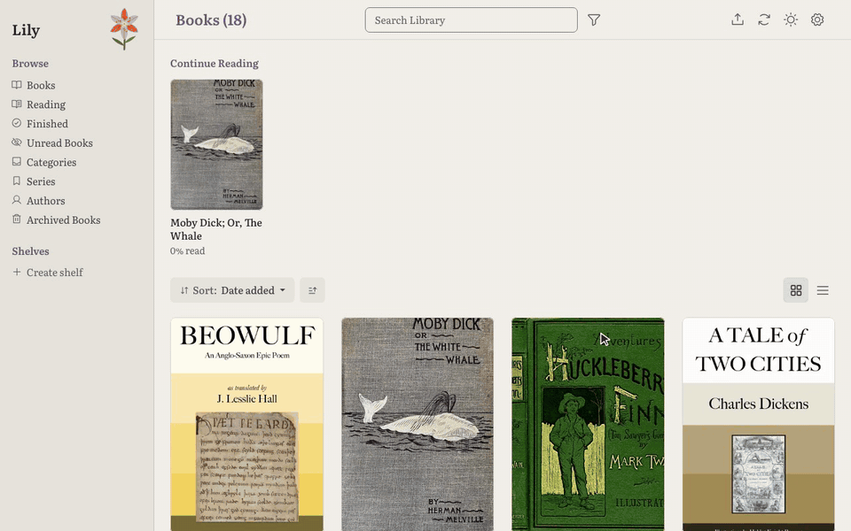
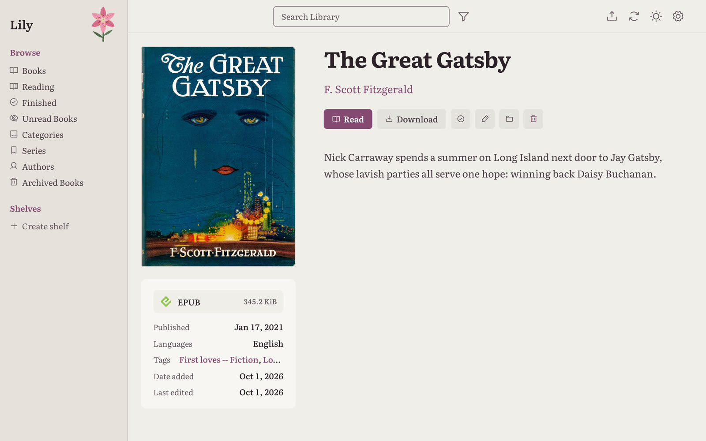
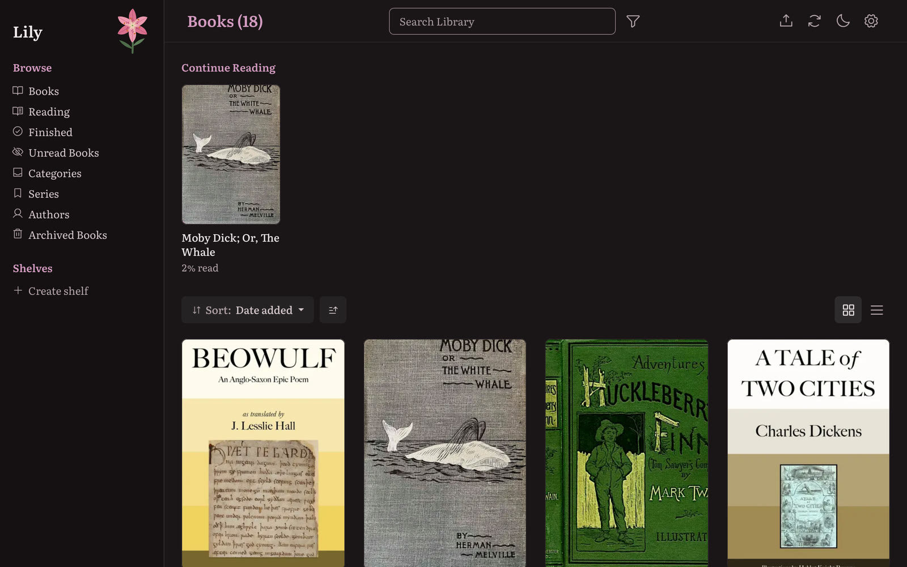

<div align="center">

<picture>
  <source media="(prefers-color-scheme: dark)" srcset="docs/assets/hero-dark.svg">
  
</picture>

<br>

[](https://hub.docker.com/r/coldestpillow/lily)
[](https://github.com/Bondyboy2001/lily/tags)
[](#install)
[](LICENSE)

**[Install](#install)** &nbsp;·&nbsp; **[Features](#features)** &nbsp;·&nbsp; **[How it works](#how-it-works)** &nbsp;·&nbsp; **[Configuration](#configuration)** &nbsp;·&nbsp; **[Docs](docs/deployment.md)**

</div>

<br>

Lily is a reading room for the books and papers you own. Drop a file into a folder and
it appears in your library with its cover, authors and description, ready to read in
any browser. There's no desktop app to keep open, no sync service and no account to
make.

<p align="center">
  
</p>

## How it works

<picture>
  <source media="(prefers-color-scheme: dark)" srcset="docs/assets/how-it-works-dark.svg">
  
</picture>

Lily watches an ingest folder. Each new file is added to a standard
[Calibre](https://calibre-ebook.com/) library, matched against online catalogues, given
a cover, and written back to disk with its metadata. The folder empties itself as it goes.
The library stays a normal Calibre library, so you can open it in Calibre whenever you like.

## Features

<table>
<tr>
<td width="50%" valign="top">

### Automatic import
Anything you drop in the ingest folder is added to the library, with no clicking
through dialogs. Duplicates are caught before they pile up.

</td>
<td width="50%" valign="top">

### Metadata that finds itself
Google Books, Open Library and Hardcover for books. arXiv and Crossref for papers.
Search by title, ISBN, DOI or arXiv id.

</td>
</tr>
<tr>
<td valign="top">

### Read anywhere
EPUB, PDF, DjVu and audiobooks open in the browser. Lily saves your place, and the
**Reading** list brings you straight back to it.

</td>
<td valign="top">

### Papers are first-class
arXiv and DOI links on the book page, and citation counts from OpenAlex. Every paper
whose metadata is fetched from arXiv lands on a shared **arXiv** shelf.

</td>
</tr>
<tr>
<td valign="top">

### A tidy library
Shelves, authors and categories. An OPDS feed for reading apps. Light and
dark themes that both get the same care.

</td>
<td valign="top">

### Your files, kept safe
Edits are written back into the book files. The databases are snapshotted every
night, and each snapshot is test-restored to make sure it works.

</td>
</tr>
</table>

<table>
<tr>
<td width="50%"></td>
<td width="50%"></td>
</tr>
</table>

## Install

Lily runs in Docker on any `amd64` or `arm64` machine, from a Raspberry Pi to a NAS.

```yaml
# docker-compose.yml
services:
  lily:
    image: coldestpillow/lily:latest   # or ghcr.io/bondyboy2001/lily:latest
    container_name: lily
    environment:
      - PUID=1000
      - PGID=1000
      - TZ=Europe/London
    volumes:
      - /path/to/config:/config
      - /path/to/ingest:/cwa-book-ingest      # emptied after each import
      - /path/to/library:/calibre-library     # an existing Calibre library, or an empty folder
    ports:
      - 8083:8083
    restart: unless-stopped
```

```bash
docker compose up -d
```

Open **<http://localhost:8083>** and sign in as `admin` with the password `admin123` (or
the one you set in `LILY_ADMIN_PASSWORD` before the first start). Lily asks for a new
password before anything else.

> [!TIP]
> Keep the three folders separate rather than nested. Move only finished files into the
> ingest folder, because it is emptied after each import. Anyone with the Upload
> permission can also upload from the browser.

## Configuration

| Variable | Default | |
|---|---|---|
| `TZ` | — | Your timezone |
| `HARDCOVER_TOKEN` | — | Turns on [Hardcover](https://docs.hardcover.app/api/getting-started/) metadata |
| `CROSSREF_MAILTO` | — | Optional contact address sent to [Crossref](https://www.crossref.org/documentation/retrieve-metadata/rest-api/tips-for-using-the-crossref-rest-api/), which serves such requests from a less crowded pool |
| `SEMANTIC_SCHOLAR_API_KEY` | — | Optional [Semantic Scholar key](https://www.semanticscholar.org/product/api#api-key-form), so paper searches aren't turned away when its shared pool is busy |
| `LILY_ADMIN_PASSWORD` | `admin123` | First admin password on a fresh install; ignored once `app.db` exists |
| `SECRET_KEY` | generated | Session signing key |
| `TRUSTED_PROXY_COUNT` | `0` | Set to `1` behind nginx, Caddy or similar |
| `SESSION_COOKIE_SECURE` | `false` | Set to `true` when served over HTTPS |
| `NETWORK_SHARE_MODE` | `false` | Set to `true` when the library is on NFS or SMB |
| `DB_BACKUP_DIR` | `/config/backup/db` | Where the nightly snapshots go |

[docs/deployment.md](docs/deployment.md) covers reverse proxies, network shares, every
environment variable and how to restore a snapshot.

## Development

```bash
docker compose -f docker-compose.yml.dev up -d --build
.venv/bin/python -m pytest tests/unit -q
```

[docs/architecture.md](docs/architecture.md) explains how the code fits together.
[docs/design.md](docs/design.md) is the design guide, and every UI change follows it.
Found a bug or have an idea? [Open an issue](https://github.com/Bondyboy2001/lily/issues/new/choose).

## Credits

Lily is a personal redesign of
[Calibre-Web Automated](https://github.com/crocodilestick/calibre-web-automated). That
project is built on [Calibre-Web](https://github.com/janeczku/calibre-web) and
[Calibre](https://calibre-ebook.com/), and Lily owes a great deal to all three. The demo
library is made of public-domain books from [Project Gutenberg](https://www.gutenberg.org/).

Lily is licensed under [GPL-3.0](LICENSE).
