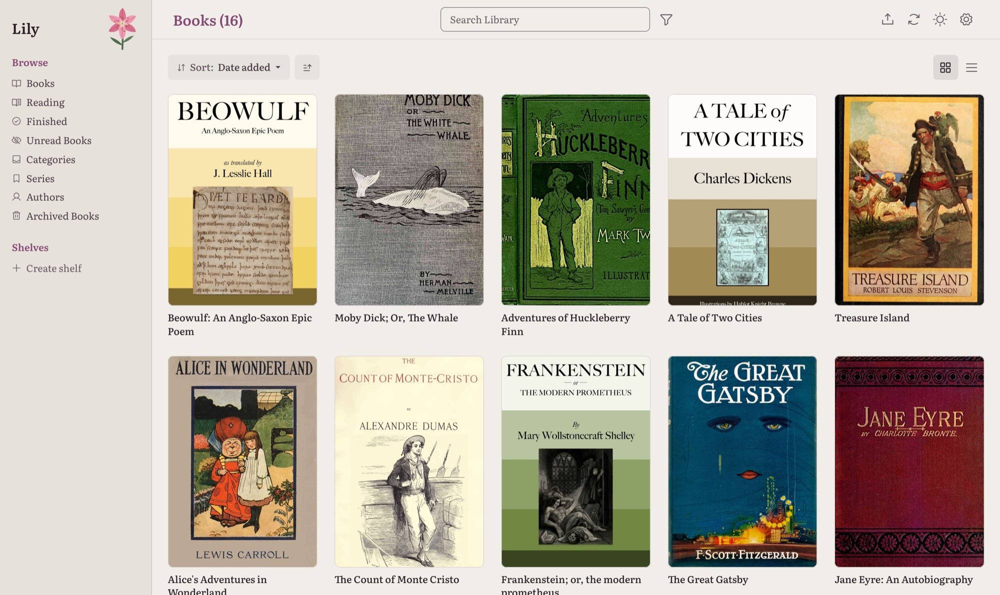

# Lily

A calm, self-hosted home for your books and papers. Drop a file in a folder and Lily
adds it to your library, finds its metadata and keeps it ready to read in the browser.



## Features

- **Automatic import.** Anything dropped in the ingest folder is added to your Calibre library.
- **Metadata that finds itself.** Google Books, Open Library and Hardcover for books; arXiv
  and Crossref for papers. Search by title, ISBN, DOI or arXiv id.
- **Read anywhere.** EPUB, PDF, DjVu and audiobooks in the browser, with your place saved.
- **Papers as first-class books.** arXiv and DOI links, and live citation counts.
- **Tidy library.** Shelves, duplicate detection, OPDS for reading apps, light and dark themes.
- **Safe by default.** Edits are written back to the book files, and the databases are
  snapshotted nightly.

## Install

```yaml
# docker-compose.yml
services:
  lily:
    image: coldestpillow/lily:latest   # or ghcr.io/bondyboy2001/lily:latest
    container_name: lily
    environment:
      - PUID=1000
      - PGID=1000
      - TZ=Europe/London
    volumes:
      - /path/to/config:/config
      - /path/to/ingest:/cwa-book-ingest      # emptied after each import
      - /path/to/library:/calibre-library     # an existing Calibre library, or an empty folder
    ports:
      - 8083:8083
    restart: unless-stopped
```

```bash
docker compose up -d
```

Open <http://localhost:8083> and sign in as **`harry` / `harry10`**. Lily asks for a new
password before anything else. Then turn on browser uploads under
**Settings → Import & Metadata** if you want them.

Keep the three folders separate, not nested. Only move finished files into the ingest
folder: it is emptied after each import.

### Options

| Variable | Default | |
|---|---|---|
| `TZ` | — | Your timezone |
| `HARDCOVER_TOKEN` | — | Enables [Hardcover](https://docs.hardcover.app/api/getting-started/) metadata |
| `SECRET_KEY` | generated | Session signing key |
| `TRUSTED_PROXY_COUNT` | `0` | Set to `1` behind nginx, Caddy or similar |
| `SESSION_COOKIE_SECURE` | `false` | Set `true` when served over HTTPS |
| `NETWORK_SHARE_MODE` | `false` | Set `true` when the library is on NFS or SMB |
| `DB_BACKUP_DIR` | `/config/backup/db` | Where nightly snapshots go |

Reverse proxies, network shares and restoring a backup are covered in
[docs/deployment.md](docs/deployment.md).

## Development

```bash
docker compose -f docker-compose.yml.dev up -d --build
.venv/bin/python -m pytest tests/unit -q
```

[docs/architecture.md](docs/architecture.md) explains how the code fits together, and
[docs/design.md](docs/design.md) is the design guide for any UI change.

## Credits

Lily is a personal redesign of
[Calibre-Web Automated](https://github.com/crocodilestick/calibre-web-automated), built on
[Calibre-Web](https://github.com/janeczku/calibre-web) and
[Calibre](https://calibre-ebook.com/). Licensed under [GPL-3.0](LICENSE).
